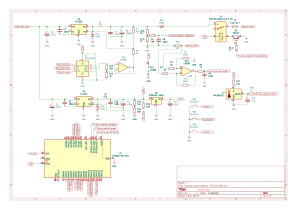
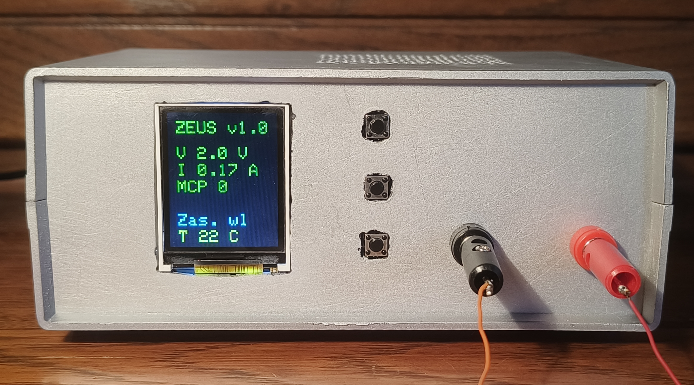
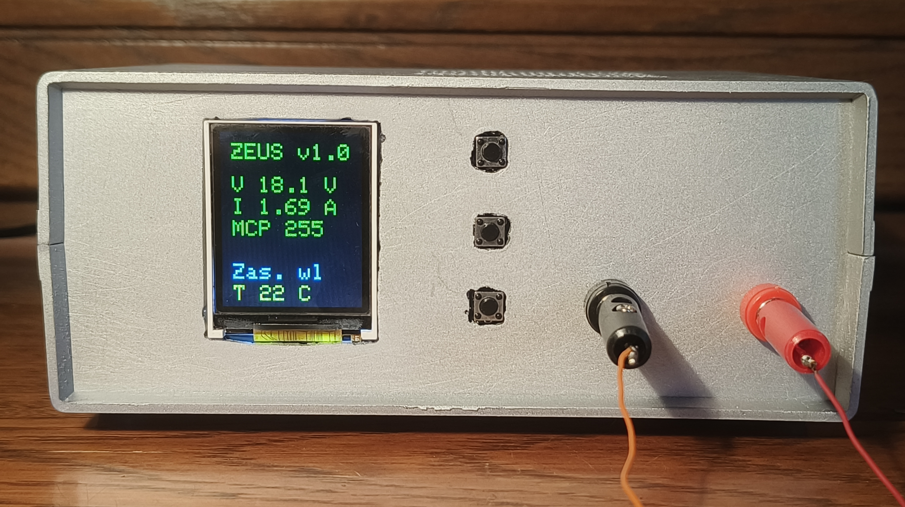
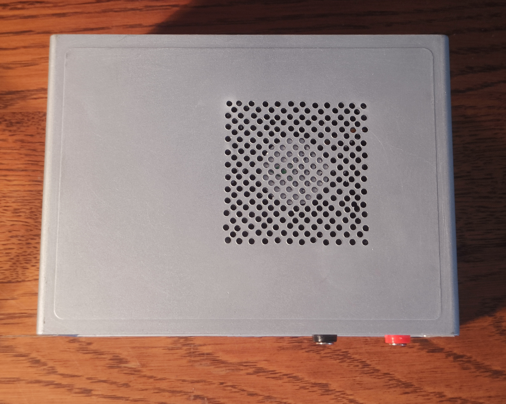
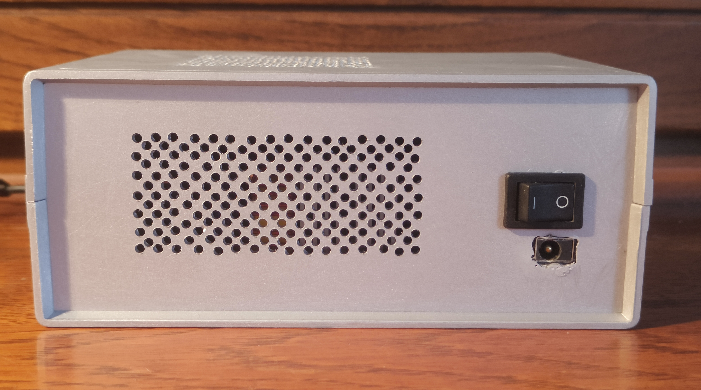
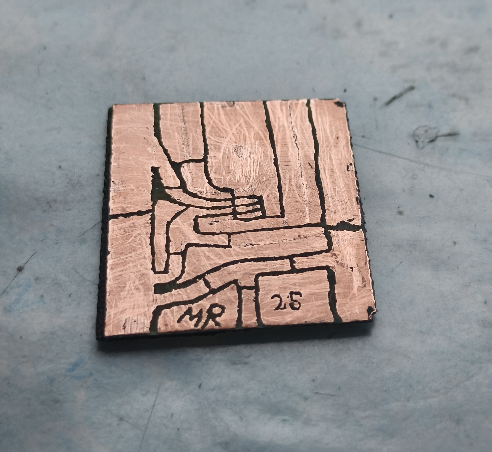

ZEUS v1.0 – DIY Digital Lab Power Supply

This is my DIY project: a digital lab power supply, fully designed, built and programmed from scratch.
It combines power electronics, microcontrollers, programming (with AI support) and many hours of testing & debugging.

🔧 Features

Output range: 2.2 – 18.5 V

Max current: 3.5 A with software current limit

Control: Raspberry Pi Pico + TFT LCD (ST7735)

Digital potentiometer: MCP41010 (8-bit, 0.064 V/step)

Protections: thermal (>70 °C), overcurrent, software limits

Hand-drawn single-layer PCB

Measurement accuracy:

Voltage: ±0.1 V (3rd order polynomial calibration)

Current: ±0.02 A (max ±0.05 A at high load)

⚙️ Measurement & Power Stage

Current: 20 mΩ shunt + MCP6022 amplifier (×33)

Voltage: resistor divider (safe up to 24 V → 25% margin)

RC filters: voltage/current (1k + 100 nF), temp (1k + 2.2 µF)

MCP6022 & MCP41010 powered from LDO 3.3 V → safe for ADC

Separate XL4015 buck → 4.8 V for Pico, fan and LCD backlight

🌡️ Cooling & Enclosure

Over 550 ventilation holes (⌀2.5 mm)

12 V fan (60×60×10 mm) powered at 4.8 V → quiet but effective

Stable temps at up to 3 A load

💡 Lessons Learned

Temperature sensor placed near Vout trace showed 15–20 °C lower values → great lesson about switching noise & thermal gradients.

Voltage/current readings "float" ±0.1 V / ±0.02 A → acceptable for DIY, but next version will use a better ADC.

Star-ground topology really improved measurement stability.

SPI works stable even without shielding → short layout + good grounding helps.

MCP41010 resolution (8-bit) is enough for prototyping, but DAC/PWM + filter is planned for v2.0.

📌 Next Steps (ZEUS v2.0)

Two-layer PCB

Higher-resolution external ADC

Improved current measurement circuit

Better temperature sensor placement

📂 Repository Contents

## Schematic

##Code

📸 Photos

## Photos

##Docs

📝 License

This project is licensed under the MIT License – feel free to use and modify, but keep attribution.
